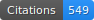

# About Me :)

I earned my Master’s degree in Artificial Intelligence from [Tsinghua University](https://www.tsinghua.edu.cn/en/) , where I conducted research under the supervision of [Prof. Haoqian Wang](https://www.sigs.tsinghua.edu.cn/whq_en/main.htm) and collaborated closely with [Prof. Yebin Liu](https://www.liuyebin.com/) on 3DV & Human Avatar Reconstruction. Prior to this, I completed my B.Eng. in Measurement and Control Technology & Instruments at [Southeast University](https://www.seu.edu.cn/english/) . During my graduate studies, I also had the privilege of visiting [Harvard University](https://www.harvard.edu/)  as a research intern, working with [Prof. Hanspeter Pfister](https://vcg.seas.harvard.edu/people/hanspeter-pfister) on computer graphics.

I am currently an Researcher at ByteDance Seed , focusing on cutting-edge challenges in <b>perception, generation, and world model</b>. 

### 📎 Homepages
- [Personal Pages](https://minghanqin.github.io/)
- Google Scholar 

## Open Opportunities

I am actively recruiting research interns to collaborate on:

- 3D Scene Perception

- 3D Content Creation

- World Model

If you are seeking any form of academic cooperation, please feel free to email me at [qinminghan1999@gmail.com](mailto:qinminghan1999@gmail.com).

## News
- *2025.09*: &nbsp;🎉🎉 3 paper accepted to NeurIPS 2025 !!!
- *2025.07*: &nbsp;🎉🎉 1 paper accepted to ACM MM 2025 !!!
- *2025.06*: &nbsp;🎉🎉 2 paper accepted to ICCV 2025 !!!
- *2025.06*: &nbsp;🎉🎉 NOVA3D has been selected as ICME 2025 <b>Bestpaper Candidate</b>!!!
- *2025.02*: &nbsp;🎉🎉 2 paper accepted to CVPR 2025 !!!

More News

- *2024.09*: &nbsp;🎉🎉 1 paper accepted to NeurIPS 2024 !!!
- *2024.07*: &nbsp;🎉🎉 1 paper accepted to ACM MM 2024 !!!
- *2024.02*: &nbsp;🎉🎉 2 paper accepted to ECCV 2024 !!!
- *2024.02*: &nbsp;🎉🎉 LangSplat has been selected as CVPR 2024 <b>Highlight</b> !!!
- *2024.02*: &nbsp;🎉🎉 1 paper accepted to CVPR 2024 !!!
- *2023.11*: &nbsp;🎉🎉 1 paper accepted to AAAI 2024 !!!

